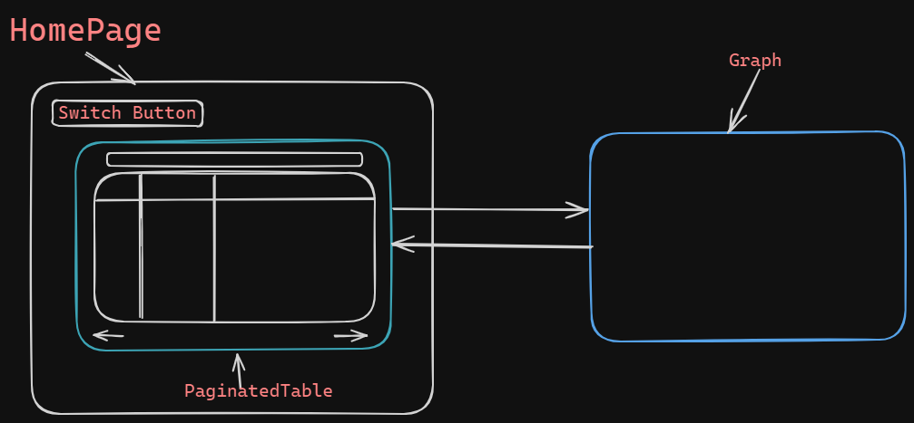

# Frontend Application with Next.js

## Table of Contents

- [Frontend Application with Next.js](#frontend-application-with-nextjs)
  - [Table of Contents](#table-of-contents)
  - [Overview](#overview)
  - [Features](#features)
  - [Technologies Used](#technologies-used)
  - [Setup Instructions](#setup-instructions)
  - [Project Structure](#project-structure)
  - [Componenets Visualization and Explanation](#componenets-visualization-and-explanation)

## Overview

This project is a frontend application developed with Next.js (version 14), featuring a paginated table displaying data fetched from the JSONPlaceholder API. It includes search functionality to filter data and sorting by table headers, all managed client-side without Server-Side Rendering (SSR).

## Features

- Display a paginated table with data fetched from JSONPlaceholder.
- Implement client-side pagination.
- Enable search functionality to filter data.
- Implement sorting by clicking on table headers.
- Bonus: Visualize data distribution using a graph component.

## Technologies Used

- Next.js 14
- React (including hooks like useState, useEffect)
- Axios (for API fetching)
- React Table (for managing table data)
- Chart.js (for data visualization)

## Setup Instructions

1. **Clone the repository:**

   ```bash
   git clone https://github.com/mAmineChniti/frontend-task
   cd frontend-task
   ```

2. **Install dependencies:**

   ```bash
   bun install
   ```

3. **Run the development server:**

   ```bash
   bun run dev
   ```

4. **Open [http://localhost:3000](http://localhost:3000) in your browser.**

## Project Structure

```bash
/frontend-task (project directory)
│
├── components/             # React components
│   ├── Table.tsx           # Component for displaying data in a table
│   ├── PaginatedTable.tsx  # Component for pagination
│   └── Graph.js            # Component for data visualization (bonus)
│
├── src/                    # Next.js pages
│   ├── app/                # App folder
│   │   ├── page.tsx        # HomePage component
│   │   └── layout.tsx      # Entrypoint
│   └────── ...
├── README.md               # Project documentation
│
└── ...
```

## Componenets Visualization and Explanation



[Table](components/Table.tsx): A table component that is a child of the PaginatedTable, this is a simple table that displays the fetched data from the API.

[PaginatedTable](components/PaginatedTable.tsx): A Parent component for the [Table](components/Table.tsx), the query input and Next/Previous buttons.

[Graph](components/Graph.tsx): A graph based on the data fetched from the API.

[HomePage](src/app/page.tsx): A parent component for the [PaginatedTable](components/PaginatedTable.tsx), [Graph](components/Graph.tsx) and the button that allows toggling between them.
